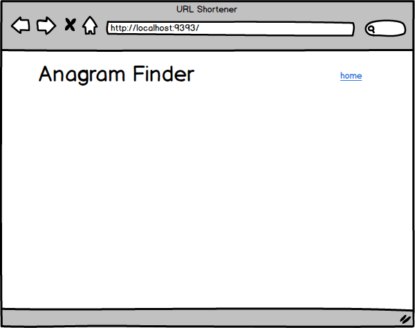
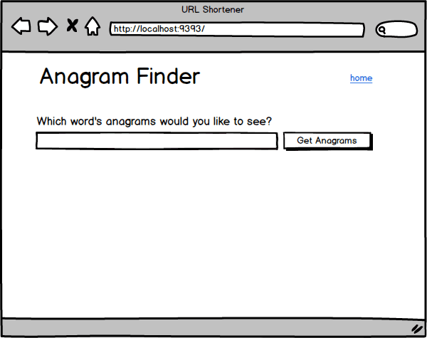

# Анаграммы в веб-приложении

## Общие сведения
Мы собираемся написать веб-приложение с базой данных. Пользователи впишут слово, наше приложение обратится к базе данных для извлечения анаграмм для этого слова, и список анаграмм будет предоставлен пользователю.

Когда создаете приложение, помните, каким образом происходит обмен данными между клиентом и сервером. Браузер будет отправлять данные через HTTP-запросы в Express. После того, как сервер получит данные от пользователя, маршрутизатор обработки запросов должен запросить у модели получение анаграмм. Затем маршрутизатор обработки запросов отображает представление для данных, возвращаемых моделью. Наконец, сервер возвращает отображаемый HTML в браузер. 


## Releases
### Пре-релиз: Установка Модулей
Убедитесь, что модули, необходимые для приложения, были установлены. В командной строке запустите `npm install`.

### Release 0: Создание модели и миграций для слов
Сначала нужно сохранить несколько слов в базе данных. Создайте базу данных с таблицей `Words` (слова) и моделью для представления слов в Sequelize.
Не забывайте, что есть удобный инструмент [sequelize-cli](https://sequelize.org/master/manual/migrations.html) для создания моделей.

- Создайте модель `Word`.


### Release 1: Пополнение Базы данных
В нашей базе данных есть таблица `Words`. Теперь мы добавим некоторые исходные данные в базу данных; это называется *засеять* базу данных. Данные, которыми мы будем пополнять нашу базу данных, хранятся в файле `fixtures/abridged_word_list.txt`. Нам нужно сохранить каждое слово в этом файле в виде слова в нашей базе данных. 

Воспользуйтесь [sequelize-cli](https://sequelize.org/master/manual/migrations.html#creating-the-first-seed) для создания `Seed'a`.
Вам потребуется реализовать следующую логику: прочитать файл `fixtures/abridged_word_list.txt`, разбить его на строки, вставить полученные строки в базу данных.
Возможно вам пригодится встроенные метод [bulkInsert](https://sequelize.org/v6/class/src/dialects/abstract/query-interface.js~QueryInterface.html#instance-method-bulkInsert)

Запустите seed через sequelize-cli

### Release 2: Модель Words находит анаграммы
Создайте подключение к базе данных в файле app.js для одновременного запуска сервера и sequelize.

Наше приложение должно найти анаграммы для данного слова. Наша модель `Word`  будет ответственна за эту функцию. Экземпляр класса `Word` вернет свои анаграммы:

```js
class Word extends Model {
  static anagrams () {
    return this.findAll(
      // Returns a collection of Word objects that are anagrams
      // of the instance on which the method is called.
    )
  }
```


### Release 3: Как показать анаграммы Слова
Мы собираемся начать разработку нашего веб-приложения, разрешив пользователям просматривать анаграммы для слова. Когда пользователи посещают URL-адрес, например `http://localhost:3000/words/leaps`, там должны быть указаны анаграммы данного слова (см. Рисунок 1). Используйте метод `Word.anagrams`, который мы описали в *Release 2*. 

*Примечание:* Помните, что наша база данных имеет ограниченное количество слов (например, leaps, melon и т.д.), поэтому мы не сможем найти анаграммы для всех английских слов. Если мы хотим, чтобы список слов в нашей базе данных был более исчерпывающим, мы можем обновить базу данных, используя файл `fixtures/word_list.txt`.



*Рисунок 1*.  Отображение анаграмм для заданного слова.


### Release 4: Запрос анаграмм с помощью формы
На данный момент, чтобы просмотреть анаграммы слов, пользователи должны вручную ввести URL-адрес. Добавьте на главную страницу форму, которая позволит пользователям задать слово, анаграммы которого они хотели бы увидеть. (см. Рисунок 2)


*Рисунок 2*.  Использование формы для получения анаграмм слова. 


### Release 5: Добавление Формы на Страницу «Слова»
Форма на домашней странице удобна, но все же просматривать анаграммы нескольких слов пока проблематично. Чтобы облегчить перескакивание от слова к слову, добавьте форму с главной страницы на страницу «Слова». (см. рисунок 3)

Для этого можете попробовать использовать отдельный React-компонент.  Данная часть задания опциональна. Начните с переноса кода для формы с домашней страницы в отдельный React-компонент, а затем включите его в  домашнюю страницу. Использование React-компонента не должно изменять способ отображения страницы в браузере.

Когда заработает React-компонент, включите его в страницу, на которой перечислены анаграммы слов.

*Примечание:* Беспокойтесь больше о функциональности формы, чем о том, чтобы отобразить ее точно так, как показано на макете.



*Рисунок 3*.  Форма, добавленная на страницу, показывающую анаграммы слов.

## Заключение
Мы создали веб-приложение, поддерживаемое базой данных. Можем ли мы отследить, каким образом данные передаются через наше приложение? Когда наш сервер получает запрос на показ анаграмм слова, что происходит? Каковы функции модели, представления и контроллера(MVC)?


[form animation]: readme-assets/form-animation.gif
[form on page]: readme-assets/form-on-page.gif
[word page animation]: readme-assets/word-page-animation.gif
[react components]: https://ru.reactjs.org/docs/components-and-props.html


